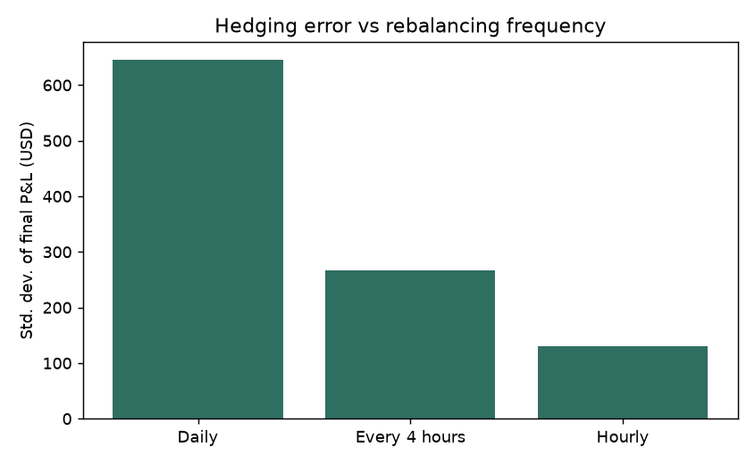
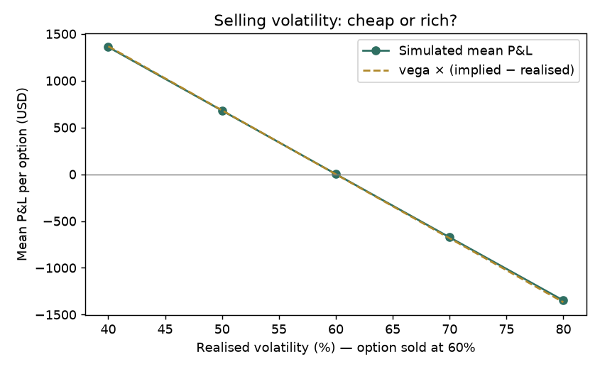
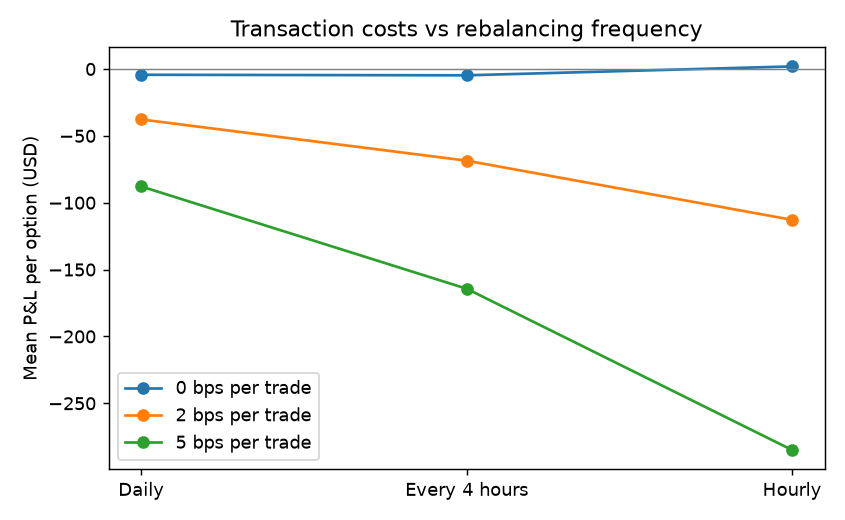

# Delta-hedging experiments

Sell one 30-day at-the-money BTC call (spot = strike = 60,000 USD, implied vol 60%,
premium 4,112 USD) and delta-hedge it until expiry. 4,000 simulated price paths (seed 0).

## 1. How often should you rebalance?

Volatility known exactly, no trading costs.

| Rebalancing | Mean P&L (USD) | Std. dev. (USD) | Std. dev. as % of premium |
|---|---|---|---|
| Daily | -4 | 645 | 15.7% |
| Every 4 hours | -5 | 267 | 6.5% |
| Hourly | +2 | 131 | 3.2% |

Daily hedging is 4.93× riskier than hourly. Theory predicts about √24 ≈ 4.90×, since hedging error shrinks
with the square root of the number of rebalances.

## 2. What if realised volatility differs from the volatility you sold at?

Option sold at 60% implied volatility, hedged hourly.

| Realised vol | Mean P&L (USD) | Approximation: vega × (implied − realised) |
|---|---|---|
| 40% | +1,360 | +1,367 |
| 50% | +680 | +684 |
| 60% | +3 | +0 |
| 70% | -674 | -684 |
| 80% | -1,348 | -1,367 |

A delta-hedged option seller is really betting that volatility will be *lower* than the price implied.

## 3. The cost of hedging more often

Mean P&L (± std. dev.) in USD, by trading cost per trade:

| Cost (bps) | Daily | Every 4 hours | Hourly |
|---|---|---|---|
| 0 | -4 (±645) | -5 (±267) | +2 (±131) |
| 2 | -38 (±647) | -69 (±270) | -113 (±138) |
| 5 | -88 (±649) | -164 (±276) | -285 (±167) |

More frequent hedging cuts risk, but every rebalance pays costs: the best frequency depends on the cost level.

## 4. Real BTC prices vs the model

24 non-overlapping 30-day windows of real hourly BTC prices, each option sold at
the period's median realised volatility (42.5%; individual windows ranged from
28% to 68%), hedged hourly.

| Paths | Mean P&L (USD) | Std. dev. (USD) | Worst 5% (USD) |
|---|---|---|---|
| Real BTC prices | -18 | 835 | -1,630 |
| Simulated (GBM), same volatility | -1 | 96 | -159 |

Real prices jump and their volatility changes over time, which Black-Scholes assumes away. The gap between
the two rows is the hedging risk the model does not see. With only 24 windows, treat it as indicative.
