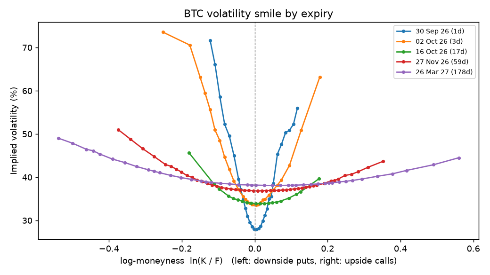
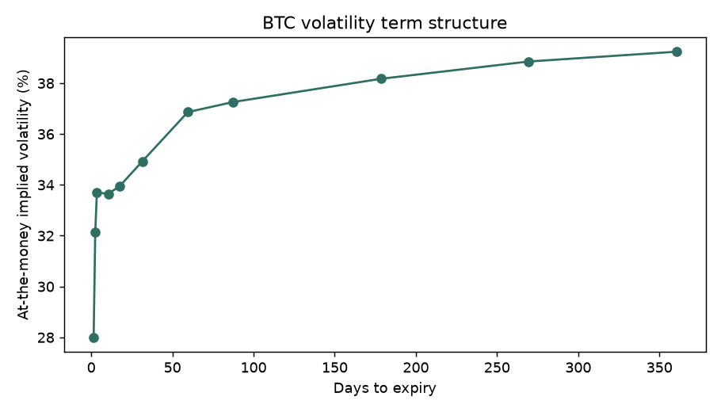

# BTC options snapshot

Taken 2026-09-28T21:03:45+00:00 from Deribit's public API: 888 options across 11 expiries.

## Does our pricing engine agree with the exchange?

Our Newton-Raphson/bisection solver was run on every option's mark price and compared with Deribit's published mark IV.

| | |
|---|---|
| Options compared | 883 |
| Median difference | 0.012 vol points |
| 95th percentile difference | 0.621 vol points |
| Within 0.5 vol points | 93.8% |
| Solver returned no answer | 5 |

## Term structure and skew

Skew = implied vol 10% below the forward minus 10% above it (positive: downside protection costs more).

| Expiry | Days | Options | ATM IV | Skew |
|---|---|---|---|---|
| 2026-09-30 | 1.5 | 29 | 28.0% | +9.7 pts |
| 2026-10-01 | 2.5 | 30 | 32.1% | +5.5 pts |
| 2026-10-02 | 3.5 | 29 | 33.7% | +5.4 pts |
| 2026-10-09 | 10.5 | 26 | 33.6% | +3.9 pts |
| 2026-10-16 | 17.5 | 20 | 33.9% | +2.0 pts |
| 2026-10-30 | 31.5 | 56 | 34.9% | +1.1 pts |
| 2026-11-27 | 59.5 | 48 | 36.9% | +0.6 pts |
| 2026-12-25 | 87.5 | 59 | 37.3% | +1.0 pts |
| 2027-03-26 | 178.5 | 52 | 38.2% | +0.5 pts |
| 2027-06-25 | 269.5 | 54 | 38.9% | +0.6 pts |
| 2027-09-24 | 360.5 | 41 | 39.2% | +0.6 pts |

